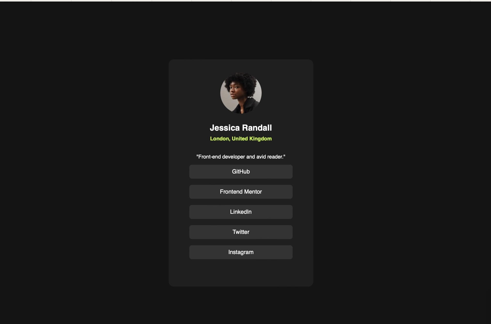

# Frontend Mentor - Social links profile solution

This is a solution to the [Social links profile challenge on Frontend Mentor](https://www.frontendmentor.io/challenges/social-links-profile-UG32l9m6dQ). Frontend Mentor challenges help you improve your coding skills by building realistic projects. 

## Table of contents

## Overview

### The challenge

### Screenshot

### Links

- Solution URL: [https://github.com/Codingtry123/social-link-profile]
- Live Site URL: [https://social-link-profile-15k.pages.dev]

## My process

### Built with

- Semantic HTML5 markup
- CSS custom properties
- Flexbox

**Note: These are just examples. Delete this note and replace the list above with your own choices**

### What I learned

how to use cursor to animate the mouse when user hovering on certain element

### Continued development

learn how to design website responsively 

### Useful resources

## Author

- Frontend Mentor - (https://www.frontendmentor.io/profile/Codingtry123)

## Acknowledgments

